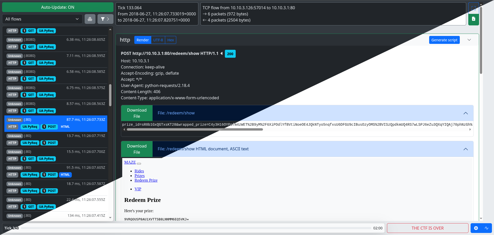
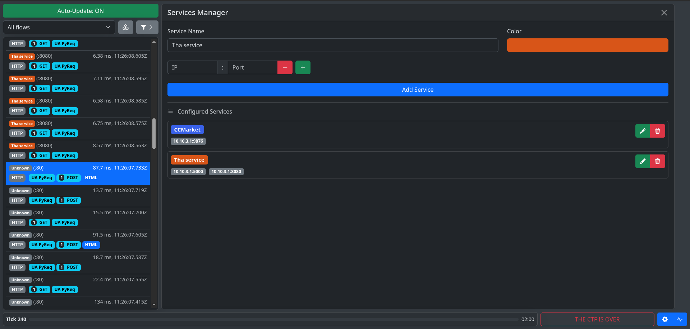
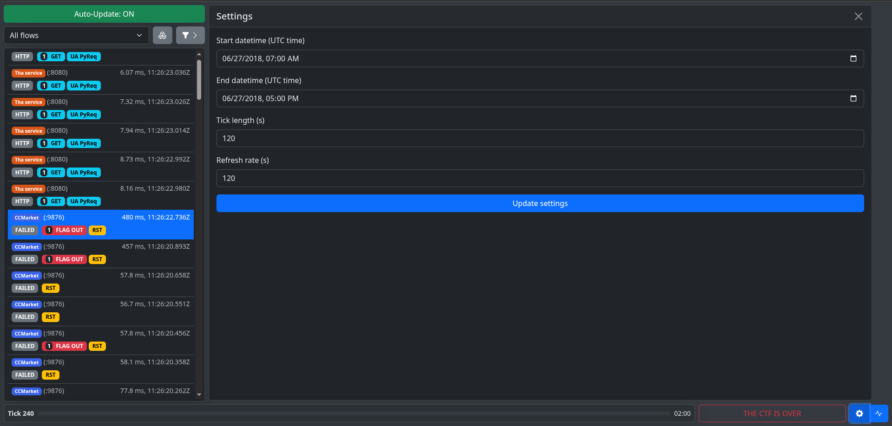

<!--
Copyright (C) 2025 Pwnzer0tt1
This file has been modified from the original version.
Licensed under GPL-3.0
-->

# Digger

## Index

- [What is Digger?](#what-is-digger)
- [Differences with Shovel](#differences-with-shovel)
- [Getting started](#getting-started)
- [Usage](#usage)
- [FAQs](#faqs)
- [Attribution & License](#attribution--license)

## What is Digger?

Digger is a web application that offers a graphical user interface to explore
[Suricata Extensible Event Format (EVE) outputs](https://docs.suricata.io/en/latest/output/eve/eve-json-output.html).
Its primary focus is to help [Capture-the-Flag players](https://en.wikipedia.org/wiki/Capture_the_flag_(cybersecurity))
analyse network flows during stressful and time-limited attack-defense games, such as
[FAUSTCTF](https://faustctf.net/), [ENOWARS](https://enowars.com/), [CyberChallengeIT](https://cyberchallenge.it/) or [ECSC](https://ecsc.eu/).
Digger is a fork of [Shovel](https://github.com/FCSC-FR/shovel) made by Pwnzer0tt1.



You might also want to have a look at these other awesome traffic analyser tools:
- <https://github.com/secgroup/flower> (first commit in 2018)
- <https://github.com/eciavatta/caronte> (first commit in 2020)
- <https://github.com/OpenAttackDefenseTools/tulip> (fork from flower in May 2022)
- **<https://github.com/FCSC-FR/shovel> (repository on which Digger is based)**

Compared to these traffic analyser tools, excluding Shovel, Digger only relies on Suricata while
making opinionated choices for the frontend. This has a few nice implications:

- dissection of all application protocols supported by Suricata (HTTP2, modbus, SMB, DNS, etc),
- flows payloads and dissections are stored inside a PostgreSQL database for fast queries,
- ingest can be a folder of pcaps for non-root CTF, or a live capture (less delay),
- tags are defined using Suricata rules (regex, libmagic match, HTTP header, etc),
- no heavy build tools needed, Digger is easy to tweak.

Moreover, Digger is batteries-included with some Suricata alert rules.

```
              ┌───►stats.log                                                  
              │                                                               
              │     ┌────►suricata.log                         ctf_config.json
              │     │                                         ┌───────────────
              │     │     ┌────►pcaps/*                       │               
              │     │     │                                   │               
           ┌──┴─────┴─────┴────────────────┐       ┌──────────▼ ────────┐     
device     │                               │       │                    │     
or pcap    │  Suricata with:               │       │                    │     
──────────►│  - Eve PostgreSQL plugin      │       │  SvelteKit webapp  │     
           │  - TCP & UDP payloads plugin  │       │                    │     
           │                               │       │                    │     
           └──────▲────────┬───────────────┘       └──────────┬─────────┘     
                  │        │                                  │               
                  │        │        ┌──────────────────┐      │               
   suricata.rules │        │        │                  │      │               
   ───────────────┘        │        │                  │      │               
                           └───────►│    PostgreSQL    │◄─────┘               
                                    │                  │                      
                                    │                  │                      
                                    └──────────────────┘                      
```

## Differences with Shovel

- The webapp is made with Svelte and Actix Web
- The UI has a fresh style with some new features: hexdump viewer, code highlighting, stats page
- CTF related settings (e.g. tick length, datetime start) are stored using a JSON file that can be edited from the webapp.
- A `run.py` that automatically starts Digger
- A single PostgreSQL container is used in place of two separated SQLite files
- Digger is distributed with a GPL-3.0 license

### Commonalities with Shovel
Most of the original code of Shovel has been completly changed.

The webapp shares some similiarities but none of the original files remained, everything is new.

The part related to Suricata is what remain in common with Shovel, except for the use of PostgreSQL as database and Diesel ORM and some minor changes.

An important part that remained the same is the template used for registering the plugins. Thanks to [FCSC-FR](https://github.com/FCSC-FR), in particular [erdnaxe](https://github.com/erdnaxe), we figured how to use Suricata 8.0.0 in Digger without breaking stuff.

The files that are currently in common with Shovel are all found inside [suricata](./suricata/), if a file was modified by us you will find a comment that specify that.


## Getting started

### Services mapping, ticks and flag format configuration

CTF related infos are stored in a JSON file and can be edited directly from the webapp:
- tick length
- available services
- start datetime
- end datetime


Add the flag format in `suricata/rules/suricata.rules` if needed.
If you modify this file after starting Suricata, you may reload rules using
`pkill -USR2 suricata`.

### Network capture

Digger currently implements 3 capture modes:

- **Mode A**: pcap replay (slower, for archives replay or rootless CTF).
- **Mode B**: capture interface (fast, requires root on vulnbox and in Docker).
- **Mode C**: PCAP-over-IP (fast, requires root on vulnbox).

Please prefer mode B or C to get the best latency between the game network and
Suricata.
Use mode A only if you are not root on the vulnbox and have access to pcap files
indirectly.

---

### Mode A - pcap capture mode (slower)

Place pcap files in a folder such as `input_pcaps/`.
If you are continuously adding new pcap, add `--pcap-file-continuous` to
Suricata command line.

A sample configuration can be found in `docker-compose-a.yml`.

> [!WARNING]
> Please note that restarting Suricata will cause all network capture files to
> be loaded again. It might add some delay before observing new flows.

---

### Mode B - Live capture interface mode (fast)

This mode requires to have direct access to the game network interface.
This can be achieved by mirroring vulnbox traffic through a tunnel,
[see FAQ for more details](#how-to-setup-traffic-mirroring-using-openssh).
Here this device is named `tun5`.

A sample configuration can be found in `docker-compose-b.yml`.

> [!WARNING]
> Please note that stopping Suricata will stop network capture.

You may also run `sudo tcpdump -n -i tun5 -G 30 -w trace-%Y-%m-%d_%H-%M-%S.pcap`
for archiving purposes.

---

### Mode C - Live capture using PCAP-over-IP (fast)

This mode requires to have access to a TCP listener exposing PCAP-over-IP.
By the default pcap-broker will connect with SSH to the vulnbox and run the command:
```bash
tcpdump -U --immediate-mode -ni game -s 65535 -w - not tcp port 22
```

If you need to route PCAP-over-IP to multiple clients, you should consider using
[pcap-broker](https://github.com/fox-it/pcap-broker).
A sample configuration is given in `docker-compose-c.yml`.

> [!WARNING]
> Please note that stopping Suricata will stop network capture.

## Usage

### Starting Digger

Digger provides a convenient `./run.py` script to manage containers and configuration. The script supports multiple commands with a user-friendly interface.

If you run `./run.py` without arguments, it will enter interactive mode where you can select actions and configure parameters through guided prompts.

Here you can find a list of available commands to use with `./run.py`:

- **`start`** - Build and start containers
- **`stop`** - Stop running containers
- **`clear`** - Clear data (Suricata output, config files, PCAP files) and stop containers
- **`status`** - Show container status
- **`logs`** - Follow container logs
- **`help`** - Show help information

#### Launching Digger

To start Digger, use the `start` command with one of the following capture modes:

- `--mode-a` - **Mode A**, for pcap replay mode
- `--mode-b` - **Mode B**, for live capture interface mode  
- `--mode-c` - **Mode C**, for live capture using PCAP-over-IP (default if not specified)

---

When using **Mode C**, you can specify additional parameters:

- **`--target-ip TARGET_IP`** (or `-ip`): IP address of the vulnbox (MANDATORY for Mode C)
- **`--key ALGORITHM`** (or `-k`): SSH private key path used for connection

Here you can find an example with the full configuration:

```bash
./run.py start --mode-c \
  --target-ip 10.60.0.1 \
  --key ~/.ssh/id_ed25519
```

#### Build and Clean Options

- `--no-build`: Skip building Docker images (use existing images)
- `--no-clean`: Skip cleaning environment (keep existing data)

#### Stopping Digger

To stop running containers:

```bash
./run.py stop
```

#### Managing Data

The **`clear`** command provides granular control over data cleanup. You can use the interactive clear by running:

```bash
./run.py clear
```

Alternatively, you can specify what to clean:

```bash
./run.py clear --suricata       # (or -s): Clear Suricata output and stop containers
```

To rapidly delete everything listed above you can use the flag `--all` (or `-A`).

To avoid the cleanup, you can add the flag `--no-clean` to the startup command.

#### Monitoring

Check container status:

```bash
./run.py status
```

Follow container logs:

```bash
# Follow all container logs
./run.py logs

# Follow logs with tail limit
./run.py logs --tail 100

# Follow specific service logs
./run.py logs webapp --tail 50
```

#### Quick Reference

For a complete list of commands and options, run:

```bash
./run.py help
```

Common command examples:

```bash
# Quick start Mode C with target IP
./run.py start --mode-c --target-ip 10.60.2.1

# Start without rebuilding images
./run.py start --mode-c --no-build

# Start preserving existing data
./run.py start --mode-c --no-clean

# Stop everything
./run.py stop

# Clean everything and stop
./run.py clear --all

# Monitor containers
./run.py status
./run.py logs
```

### Customizing services

You can customize the configuration directly from the web interface, all the changes are saved in file called `ctf_config.json`.

Click on the settings icon in the top left corner to open the **Service Manager** modal. Here you can add:

- service name,
- ip:port used (we support services with multiple IPs and ports),
- colour (helps to identify the service in the flow list).




### Settings

In order to work properly and display correct informations Digger requires specific configuration about the CTF you are playing:
- tick length (default to 120 seconds)
- start datetime (default to present datetime)
- end datetime (default to present datetime + 8 hours)

Digger includes an auto-refresh feature that automatically refreshes the flow list with an interval specified in the configuration. After updating, the interface will scroll to the previously selected flow (if any), by default is every 60 seconds. The auto-refresh is client specific, that means every user can decide the refresh interval.

The auto-refresh feature can be toggled by clicking the **Auto-Update** button in the top left corner of the web interface.

You can update this values at runtime from **Settings** in the web interface.



## FAQs

### Is Suricata `flow_id` really unique?

`flow_id` is derived from timestamp (ms scale) and current flow parameters (such
as source and destination ports and addresses). See source code:
<https://github.com/OISF/suricata/blob/suricata-6.0.13/src/flow.h#L680>.

---

### How to setup traffic mirroring using OpenSSH?

Most CTF uses OpenVPN or Wireguard for the "game" network interface on the vulnbox,
which means you can duplicate the traffic to an OpenSSH `tun` tunnel.
Using this method, Digger can run on another machine in live capture mode.

> [!WARNING]
> If you need to clone a physical Ethernet interface such as `eth0`,
> you will need to use `-o Tunnel=ethernet -w 5:5` in the SSH command line to create a `tap`.

To achieve traffic mirroring, you may use these steps as reference:

1. Enable SSH tunneling in vulnbox OpenSSH server:

   ```bash
   echo -e 'PermitTunnel yes' | sudo tee -a /etc/ssh/sshd_config
   systemctl restart ssh
   ```

2. Create `tun5` tunnel from the local machine to the vulnbox and up `tun5` on vulnbox:

   ```bash
   sudo ip tuntap add tun5 mode tun user $USER
   ssh -w 5:5 root@10.20.9.6 ip link set tun5 up
   ```

3. Up `tun5` on the local machine and start `tcpdump` to create pcap files:

   ```bash
   sudo ip link set tun5 up
   sudo tcpdump -n -i tun5 -G 30 -Z root -w trace-%Y-%m-%d_%H-%M-%S.pcap
   ```

4. Mirror `game` traffic to `tun5` on the vulnbox.
   This can be done using Nftables netdev `dup` option on `ingress` and `egress`.

---

### How do I reload rules without restarting Suricata?

You can edit suricata rules in `suricata/rules/suricata.rules`, then reload the rules
using:

```bash
pkill -USR2 suricata
```

## Attribution & License
This project is a fork of [Shovel](https://github.com/FCSC-FR/shovel), which included code under
the following licenses:

- [CC0 1.0 Universal](./Shovel-LICENSES/CC0-1.0.txt)
- [MIT License](./Shovel-LICENSES/MIT.txt)
- [GNU General Public License, version 2.0 or later](./Shovel-LICENSES/GPL-2.0-or-later.txt)

In accordance with the "or later" clause of the GPL-2.0-or-later license, and
the GPL compatibility of CC0 and MIT, this fork is distributed under the terms
of the GNU General Public License, version 3.0 (GPL-3.0).

All future contributions to this repository will be licensed under [GPL-3.0](./LICENSE).